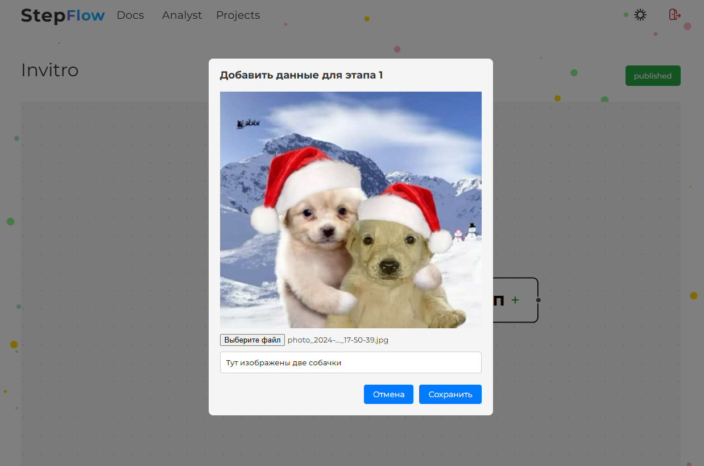

# Onboarding designer

In the onboarding designer section, you can add stages for onboarding, delete unnecessary stages, change the status of onboarding, save changes.

To add or remove a stage, click on the plus or minus located on the stage.

To change the status of a project, just click on the status button.

You can also edit stages, to proceed to editing a stage, just click on the desired stage.

Here you can add an image for a stage and add the stage text to a special field.

