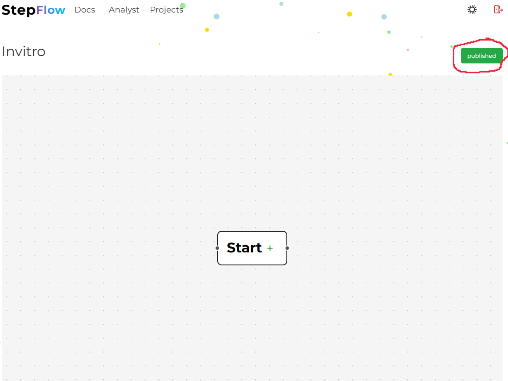
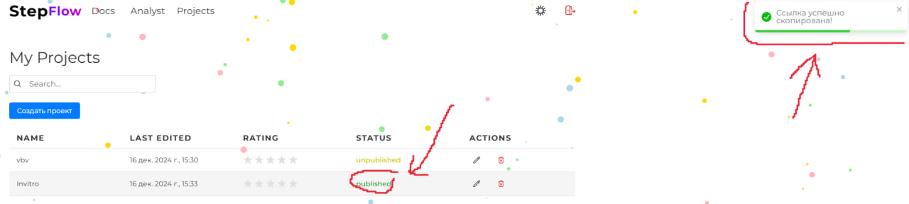

# Embedding boards

To integrate onboarding into your product, you have the following option: 
1. Create a project if there was no such thing

2. Publish it if there was no such thing

3. Start on the published die

After these actions, you will have a link to the published onboarding in your clipboard and you can use it at your discretion, you can send it or integrate it into page elements.
