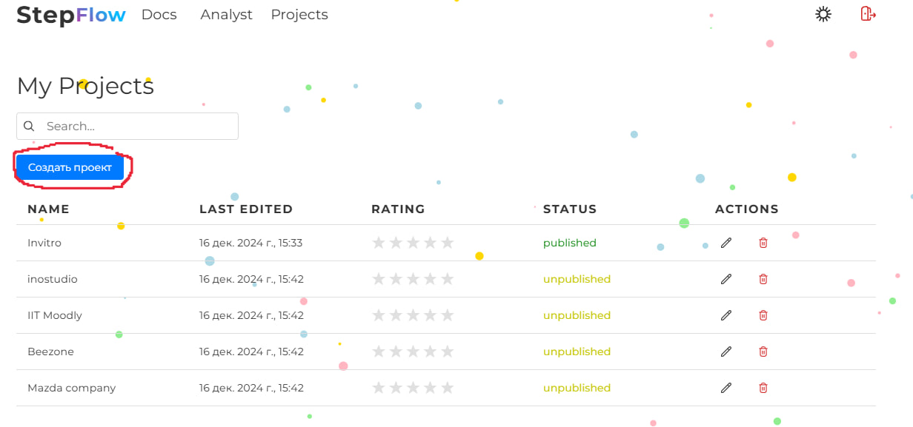
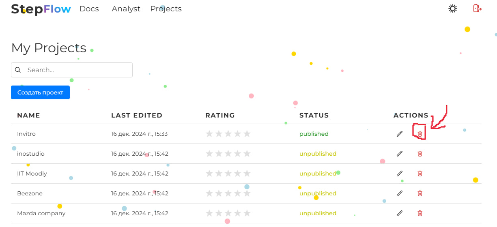
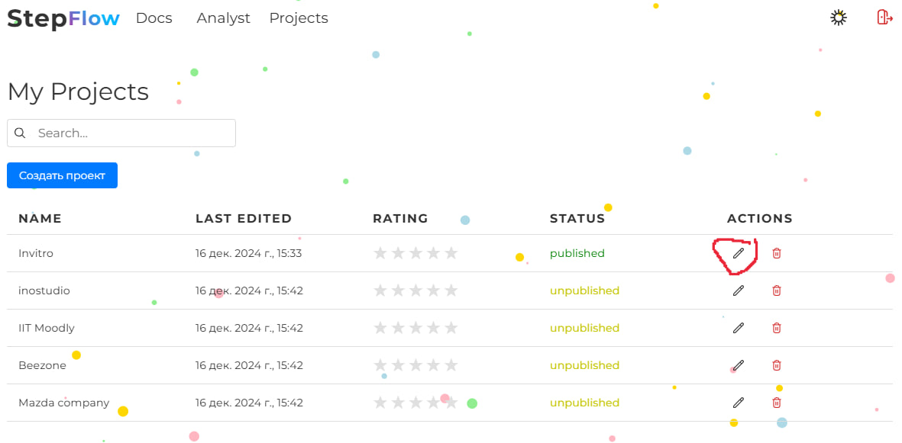
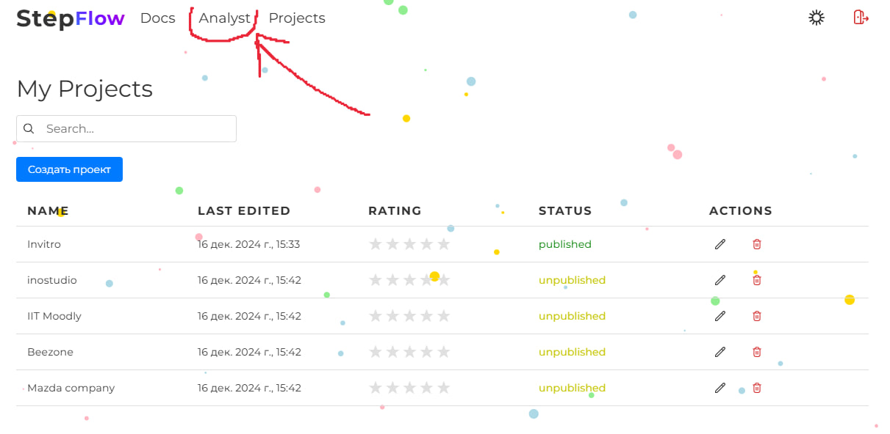
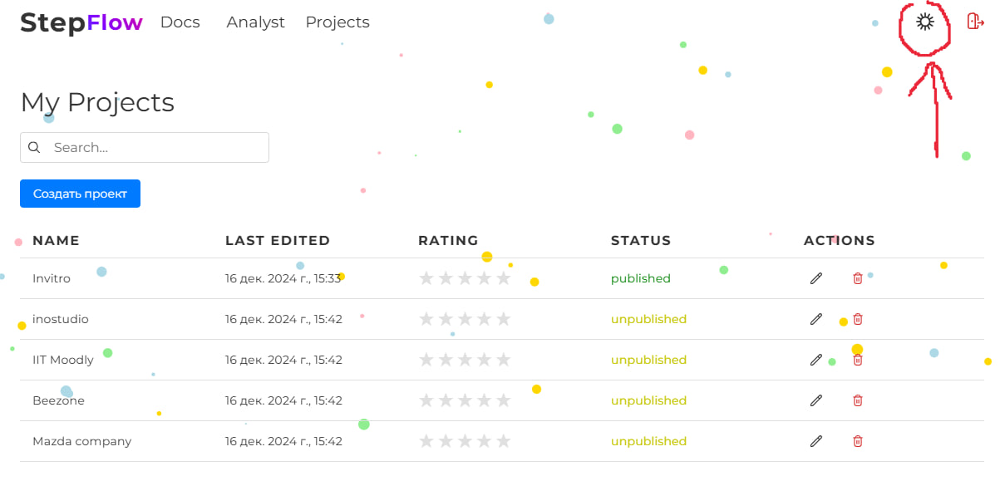
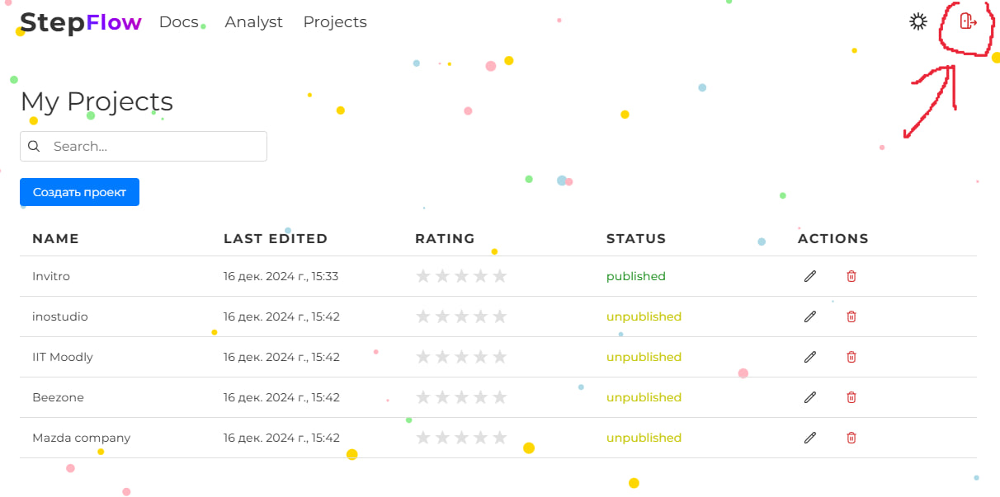

# List of projects

The list of projects contains the following information: the name of the onboarding, the date of the last edit, the average rating of the onboarding, the status of the onboarding.

In this section you have the opportunity to: 
- Create a project

- Delete a project 

- Go to designer onboarding

- Go through the sidebar to project analytics

- Turn on the dark theme

- Log out of your account

